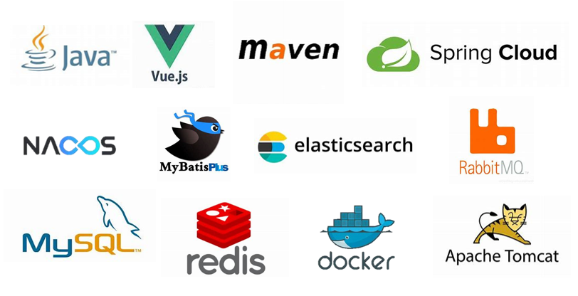

# YoungManStore

## 1前言

本项目基于[hai-27](https://github.com/hai-27) 开源的[vue-store](https://github.com/hai-27/vue-store) 项目和另一位改进了此项目的同学（时间久远没记住另一位同学的名字，我借鉴了他的一些前端页面，比如我的订单页面，就只记得他使用了Go开发了后端接口），感谢这两位同学！还有，本项目也借鉴了 [【尚硅谷】计算机毕业设计丨10小时搞定B2C电商毕设项目（包含前端+后端，轻松结业）](https://www.bilibili.com/video/BV1x14y1p73e)视频的部分内容，授课老师讲解得非常专业细致，感谢尚硅谷！

## 2本人工作

我借鉴了这个项目，前端沿用了[hai-27](https://github.com/hai-27)的大部分设计，以及另一位同学的一些页面，改进了部分UI设计，配色也加入了华为商城的红色配色。后端部分变动不大，沿用大部分接口特色，开发了新功能的接口，完善了项目大部分功能。

项目使用了绝大部分常见的技术，如图所示：

## 3项目部署

该项目部署在**2**台**2核2G**的云服务器上，项目依赖于**Docker**部署，部署流程参考[部署服务器文档](https://wlhsdxn.github.io/pdfView/web/viewer.html?file=/pdf/pdf/server_opt.pdf)。其中一台服务器部署内容如图所示：

主要是除了后端之外的所有依赖项。另一台服务器部署内容如图所示：

主要是后台微服务的部署。

## 4运行演示

可以访问[前端](http://43.136.129.168/)，[后端](http://47.113.221.137:3011/admin)（2023年7月20日前有效）。

> 提示：
> 1支付宝账号密码在详情里面
> 2建议电脑屏幕分辨率1920*1080，浏览器是100%显示
>
> 现有问题：
> 1无手机端web页面，只能电脑端打开
> 2有一半加载动画不能显示，而我的订单页面就可以看到加载动画
> 3未登录的时候，点击我的订单会跳转到登录页面，不知道为什么上传到服务器，就不跳转了
> 4订单查询为空就给了警告弹窗，应该无弹窗，只提示无内容即可
> 5没有领优惠券功能

为方便后续访问，这里提供了运行时界面动图，如下：

### 4.1前端

首页

用户注册

用户登录

用户注销

用户选择商品加入购物车

查看购物车并提交订单

查看订单详情并支付订单

催发货和确认收货

用户个人中心

用户可修改内容

### 4.2后端

后端登录

后端功能展示

## 5最后

由于项目特殊，源码将在2024年6月1日上传。